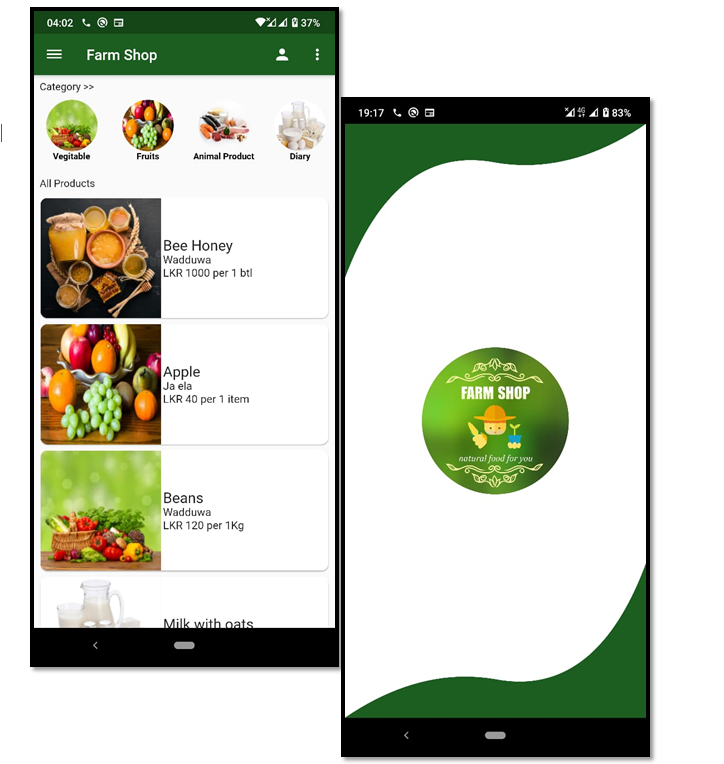

# Farm Shop

e-Farm is an open source mobile application platform for buying and selling farm items.🥗🍗

This application powered by ⚡Flutter⚡ dart framework

## Getting Started

1. Install Flutter

   Follow the official [guide](https://flutter.dev/docs/get-started/install) from the flutter team.

2. Run `flutter doctor`

   `flutter doctor`
   In here you can find whether all are okay

3. Go to the farm_shop folder

   `cd farm_shop/`

4.Install all the dependent flutter packages.

    `flutter pub get`

5.Run the application.

    `flutter run`

